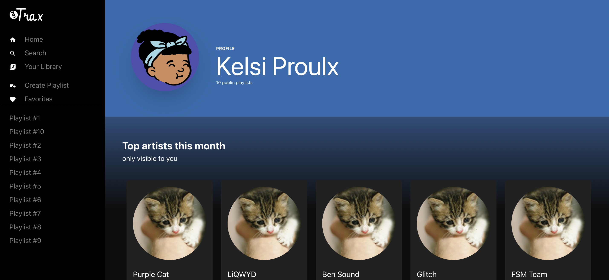
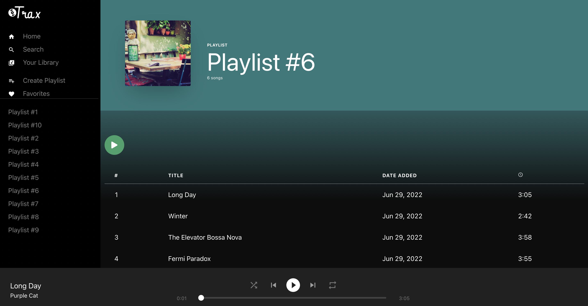

# Spotify Clone

This Spotify Clone web app was built with Next.JS, TypeScript, Node.JS, and Prisma. It includes user/email authentication, home page, playlists, and music player with shuffle, repeat, play, current duration, and seek bar. This project takes advantage of different Next.js features like API routes protection by using a middleware edge function that checks users token, custom hooks with SWR to fetch user and playlists data, server side rendering to load playlists by exporting the getServerSideProps function, manages the music player state with the Easy Peasy library and synchronizes its UI updates using the requestAnimationFrame method.

The live site can be found [here](https://spotify-clone-kelsi2.vercel.app/signin).

**Note: The user email/pass to access the app is user@test.com/password. As the database is deployed at Heroku Free Tier it needs some minutes to awake and reload after the first authentication intent.**

## Tech Stack

Frontend: React.JS,Next.js, TypeScript, Chakra UI, React Howler, React Material Design Icons<br />
Backend: Node.JS<br />
Authentication: BCrypt and JWT<br />
API/Database: Prisma and PostgreSQL<br />
Deployment: Vercel and Heroku<br />

## Screenshots




## Getting Started

To run this project locally:

1. Clone this repository
2. Yarn install
3. Run `npx prisma migrate dev`
4. Go to Heroku and create a new project 
5. Create 2 databases within that project
6. Create an `env` file:
```js
DATABASE_URL="URL1"
SHADOW_DATABASE_URL="URL2"
```
7. Run `yarn dev` to start the project
8. Go to `localhost:3000` to view the project
9. Login with `user@test.com/password`
